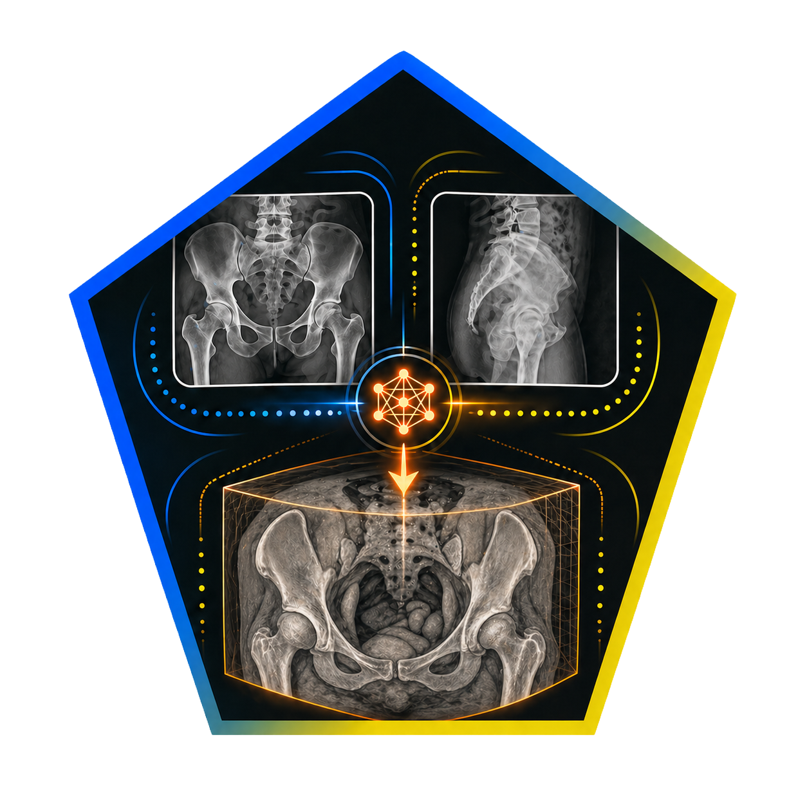
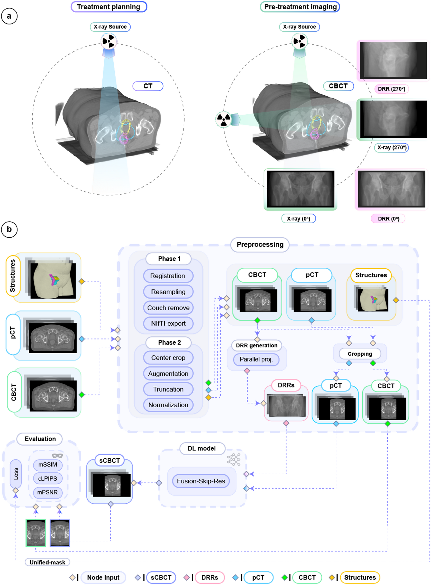

<p align="center">
  
</p>

<h1 align="center">
  Anatomically Informed Deep Learning for Fast, Low-Dose Synthetic CBCT
</h1>

<p align="center">
  <strong>Generating volumetric synthetic CBCT from ultra-sparse 2D projections and planning CT for prostate radiotherapy</strong>
</p>

<p align="center">
  <a href="https://www.nature.com/articles/s41598-025-23781-7">
    
  </a>
  
  
  
</p>

<p align="center">
  <a href="https://www.nature.com/articles/s41598-025-23781-7"><strong>📄 Read the paper</strong></a>
  ·
  <a href="#-overview"><strong>🔍 Overview</strong></a>
  ·
  <a href="#-citation"><strong>📚 Citation</strong></a>
</p>

---

<p align="center">
  <a href="https://www.nature.com/articles/s41598-025-23781-7">
    
  </a>
</p>

<p align="left">
  <em>Overview of data types and framework. (a) Comparison of standard imaging procedures in prostate cancer radiotherapy. Left: Volumetric CT image acquisition to define target volumes and organs at risk used for accurate treatment planning. Overlayed on pCT are key radiotherapy structures being: PTV (teal), bladder (yellow) and rectum (magenta). The PTV delineates the area receiving 95% of the prescribed radiation dose. Right: Volumetric CBCT and/or orthogonal X-ray images that could be acquired for daily image-guided radiotherapy to verify prostate cancer patient setup and anatomy. The orthogonal images are acquired consecutively by rotating the machine gantry to each angle. Radiotherapy structures are overlaid on the CBCT to highlight the relevant anatomical regions considered during decision making at treatment delivery. (b) Flowchart of the data preprocessing, model inputs/output, and proposed model evaluation workflow. Dashed arrows indicate information flow through various stages of the framework. For each patient, radiotherapy structures (yellow box), pCT (blue box), and CBCT (green box) images were collected. In phase 1 of data preprocessing, all images underwent rigid registration, resampling, exclusion of non-body regions (couch remove), and conversion to NIfTI format. In phase 2, online (on the fly) preprocessing with the MONAI45 framework was implemented to center crop, augment (e.g., translations, rotations), truncate intensity between [-1000, 2000] Hounsfield units (HU), and normalize the images using per case min-max normalization to be between [0,1]. Further preprocessing details are provided. The PTV, bladder and rectum structures were converted into binary masks and combined to form a unified binary mask (Unified-mask). The Unified-mask was exclusively used during model training to serve as input to our hybrid anatomically informed loss function, ALF. The DRR images were generated via parallel projections from augmented CBCTs immediately after phase 2. The DRRs and cropped pCTs served as inputs to the DL model (Fusion-Skip-Res). The predicted sCBCTs (purple) along with their corresponding ground truth CBCTs (green) were used for loss computations and evaluation using masked mMAE, mSSIM, mPSNR, and cLPIPS. The body contour (beige) was used during preprocessing (b) and defined the region for calculating the masked image quality metrics.</em>
</p>

---

## 🔍 Overview

This repository provides the open-source implementation of the **Fusion-Skip-Res** deep learning framework presented in our Scientific Reports article:

> **Anatomically informed deep learning framework for generating fast, low-dose synthetic CBCT for prostate radiotherapy**  
> Kadhim *et al.*, *Scientific Reports*, 2025.

The framework generates volumetric **synthetic cone-beam CT (sCBCT)** images from:

- Two orthogonal 2D digitally reconstructed radiographs (**DRRs**), and  
- A reference 3D planning CT (**pCT**).

The aim is to explore whether fast, low-dose 2D imaging can be used to recover clinically relevant 3D anatomical information for image-guided prostate radiotherapy.

---

## 🧠 Framework at a glance

| Component | Description |
|---|---|
| **Input** | Two orthogonal 2D DRRs + one 3D planning CT |
| **Output** | Volumetric synthetic CBCT |
| **Architecture** | Fusion-Skip-Res dual-branch 2D/3D encoder-decoder network |
| **Clinical focus** | Prostate radiotherapy image guidance |
| **Anatomical guidance** | PTV, bladder, and rectum-informed loss function |
| **Goal** | Fast, low-dose 3D anatomical verification from sparse imaging |

---


## 📚 Citation
If you find this work useful, please consider citing the paper.
```bibtex
@article{kadhim2025anatomically,
  title={Anatomically informed deep learning framework for generating fast, low-dose synthetic CBCT for prostate radiotherapy},
  author={Kadhim, Mustafa and Persson, Emilia and Haraldsson, Andr{\'e} and Jamtheim Gustafsson, Christian and Nilsson, Mikael and K{\"u}gele, Malin and B{\"a}ck, Sven and Ceberg, Sofie},
  journal={Scientific Reports},
  volume={15},
  pages={36106},
  year={2025},
  doi={10.1038/s41598-025-23781-7}
}
```
---

## ✨ Key features

### 🔀 Dual-input architecture

Combines sparse 2D projection information with patient-specific 3D anatomical context from the planning CT.

### 🧩 Fusion-Skip-Res model

Uses a dual-branch 2D/3D encoder-decoder design with feature fusion, skip connections, and residual learning.

### 🎯 Anatomically informed loss function

Guides reconstruction quality using clinically relevant anatomical structures, including the **PTV**, **bladder**, and **rectum**.

### ⚡ Fast volumetric inference

Generates synthetic CBCT volumes in approximately **8 ms per case**, excluding data loading and GPU warm-up.

### 🏥 Radiotherapy-focused evaluation

Includes masked image-quality evaluation to reduce the influence of irrelevant background voxels and focus on patient anatomy.

---


## 🔐 Data availability

The medical imaging data used in the study are not distributed through this repository due to patient privacy and ethical restrictions.

Please refer to the published article for details regarding data availability.

---
---

## 📜 License

Please add a `LICENSE` file to clarify how others may use this code.

Recommended options:

- **MIT License** — simple and permissive

---

<p align="center">
  <strong>⭐ If this work is useful for your research, please consider starring the repository and citing the paper.</strong>
</p>
